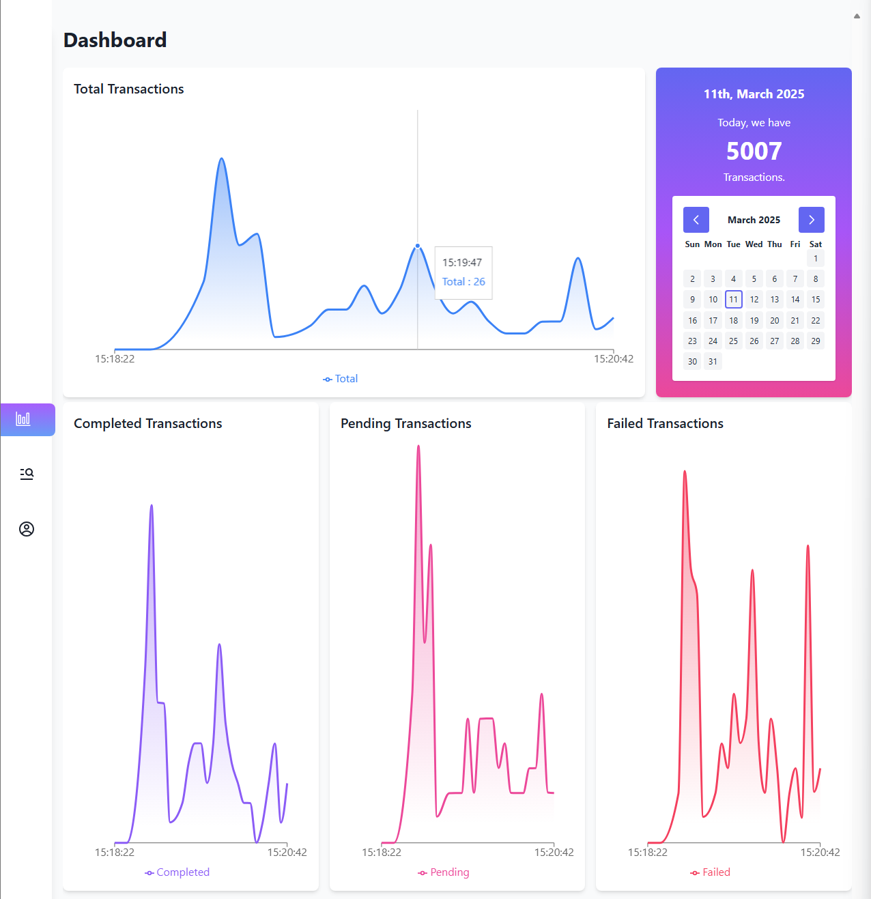
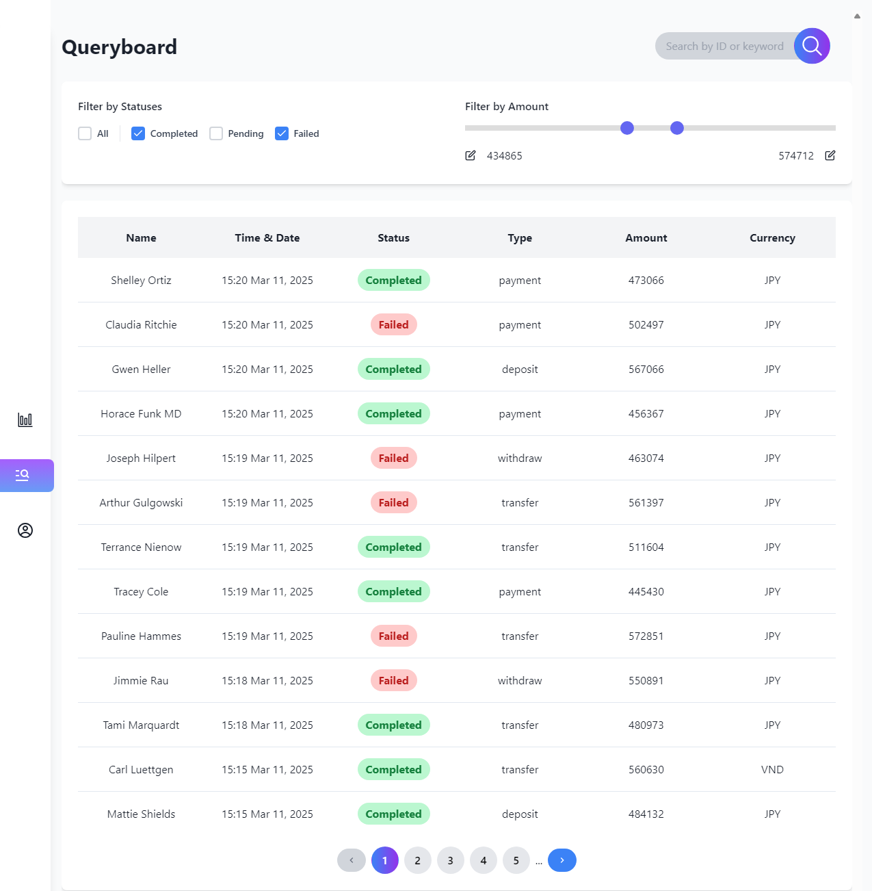
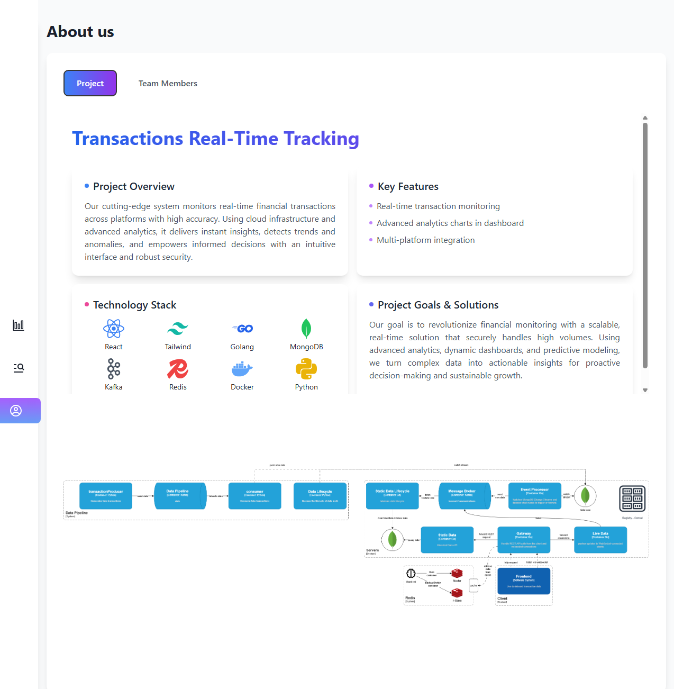
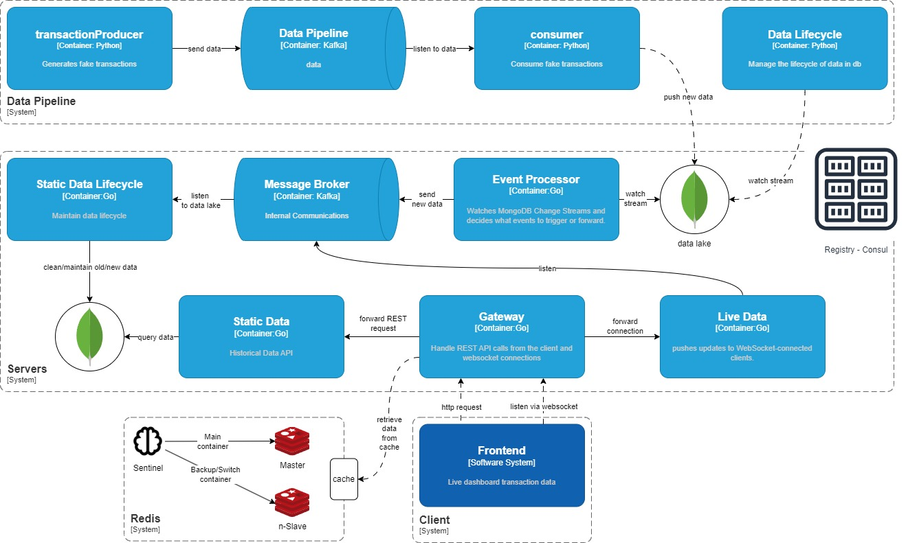

# Streaming Data Platform

<figure style="width: 100%; text-align: center;">
  <div style="display: flex; justify-content: space-around; align-items: center; width: 100%;">
    
    
    
  </div>
  <figcaption style="font-style: italic; margin-top: 10px; text-center">Project Screenshots: Dashboard, Queryboard, About</figcaption>
</figure>

This project consists of a backend and frontend setup to manage and visualize data.


## Simulates real-time data

1. Navigate to the data-pipeline dirctory:

   ```bash
   cd data-pipeline

   ```

2. Run and build docker images:

   ```bash
   docker-compose up -d --build

   ```

3. To shut docker container down:
   ```bash
   docker-compose down -v
   ```

## Backend Setup

1. Navigate to the backend directory:

   ```bash
   cd backend

   ```

2. Run and build docker images:

   ```bash
   docker-compose up -d --build

   ```

3. To shut docker container down:
   ```bash
   docker-compose down -v
   ```

## Frontend Setup

1. Navigate to the backend directory:

   ```bash
   cd frontend

   ```

2. Run and build Frontend on Docker:

   ```bash
   ### 2.1. If you are using Window OS:
   ./setup.bat

   ### 2.2. If you are using Mac OS:
   chmod +x setup.sh
   ./setup.sh
   ```

## License

This project is licensed under the [MIT License](LICENSE).
